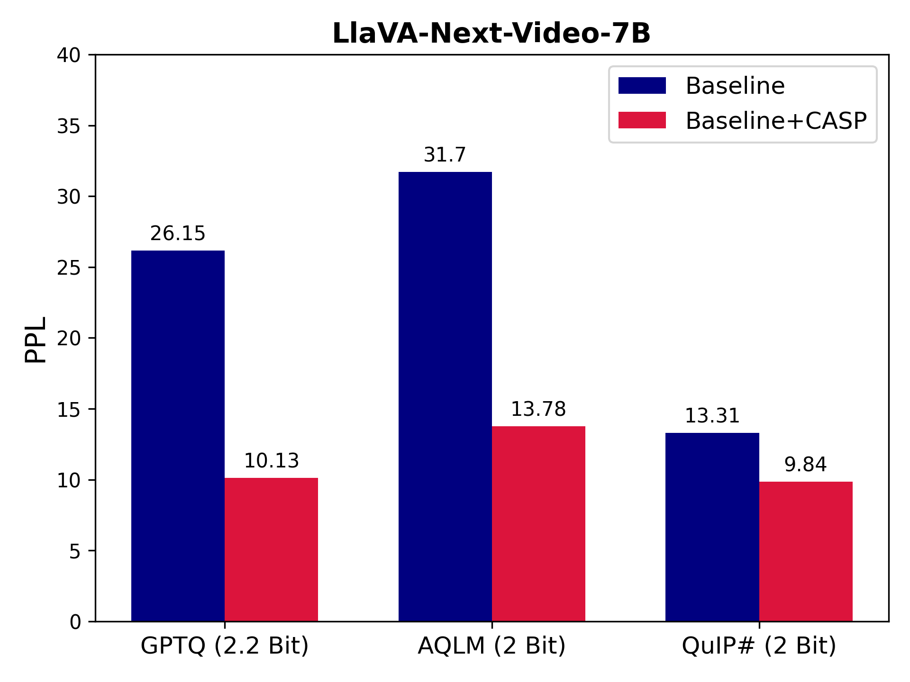
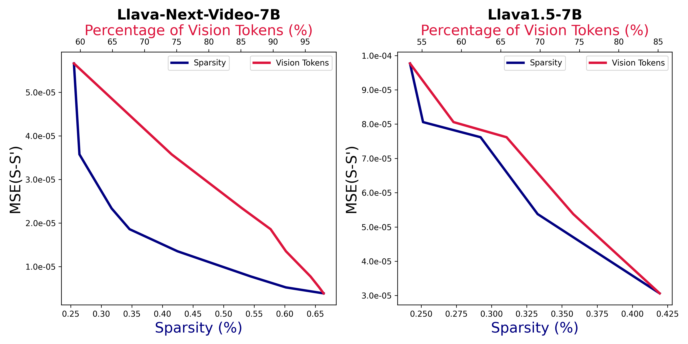

<div align ="center">

<h2>CASP: Compression of Large Multimodal Models Based on Attention Sparsity</h2>

[Mohsen Gholami](https://scholar.google.ca/citations?hl=en&user=6zlnAJgAAAAJ&view_op=list_works&sortby=pubdate), [Mohammad Akabri](https://scholar.google.ca/citations?user=-88eCXIAAAAJ&hl=en), [Kevin Cannons](https://scholar.google.com/citations?user=2JtzQe4AAAAJ&hl=en), [Yong Zhang](https://scholar.google.ca/citations?user=K2zamrwAAAAJ&hl=en),

Huawei Technologies Canada

[](https://arxiv.org/pdf/2503.05936)

</div>


The code will be released soon...
<p float="left">
  
  
</p>

##  Highlights

* CASP proposes a 2-bit compression method for VLMs that is compatible with any quantization technique and enhances state-of-the-art 2-bit quantization methods (AQLM and QuIP#) by an average of 21% on image- and video-language benchmarks
## 📚 Citation
If you find CASP useful in your research or applications, please consider giving us a star &#127775; and citing it by the following BibTeX entry.


```bibtex
@misc{gholami2025caspcompressionlargemultimodal,
      title={CASP: Compression of Large Multimodal Models Based on Attention Sparsity}, 
      author={Mohsen Gholami and Mohammad Akbari and Kevin Cannons and Yong Zhang},
      year={2025},
      eprint={2503.05936},
      archivePrefix={arXiv},
      primaryClass={cs.CV},
      url={https://arxiv.org/abs/2503.05936}, 
}
```
